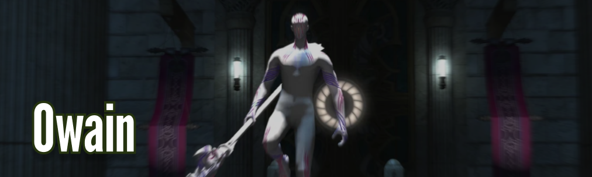
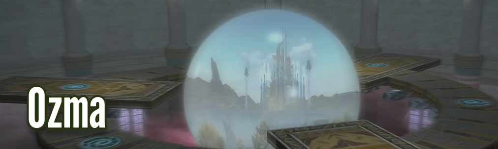

Boss Attack Queue Sheet
=======================
{:.no_toc}

* TOC
{:toc}

Art
---
1. **Tankbuster/thricecull**{:.tank}
2. In or Out/ Spinner or Carver (Donut or Circle AoE)   
3. In or Out/ Spinner or Carver (Opposite of 2.)
4. **Raidwide/acallum na senorach (Shield healers shields up, Eurekan Potion)**{:.healer}
5. Spear Summon/Mythcall (Prepare to move in or out)
6. In or Out/ Spinner or Carver (Donut or Circle Aoe)
7. Spear In or Out/ Spinner or Carver Move to him if Circle aoe, Move to spear if Donut
8. **Raidwide/acallum na senorach (Shield healers shields up, Eurekan Potion)**{:.healer}
9. **Tankbuster/thricecull**{:.tank}
10. Spear Summon/Mythcall (Prepare to move in or out)
11. In or Out/ Spinner or Carver (Donut or Circle Aoe)
12. Spear In or Out/ Spinner or Carver Move to him if Circle aoe, Move to spear if Donut
13. Dodge aoe and immediately after stop moving/Legendary Geas *Loopstart*
14. **Raidwide/acallum na senorach (Shield healers shields up, Eurekan Potion)**{:.healer}
15. Proximity AoE + Gravity ball (marked player away from the group!)
16. **Tankbuster/thricecull**{:.tank}
17. **Raidwide/acallum na senorach (Shield healers shields up, Eurekan Potion)**{:.healer}
18. Spear summon/mythcall + dont move/Legendary Geas! (dodge aoes)
19. In or Out/ Spinner or Carver (Donut or Circle Aoe)
20. Spear In or Out/ Spinner or Carver Move to him if Circle aoe, Move to spear if Donut
22. **Tankbuster/thricecull**{:.tank}
23. **Raidwide/acallum na senorach (Shield healers shields up, Eurekan Potion)**{:.healer}
24. Spear Summon/Mythcall (Prepare to move in or out)
25. Piercing dark, move aoe markes out of the group
26. In or Out/ Spinner or Carver (Donut or Circle Aoe)
27. Spear In or Out/ Spinner or Carver Move to him if Circle aoe, Move to spear if Donut

Owain
-----
1. **Tankbuster/thricecull**{:.tank}
2. **Raidwide/acallum na senorach (Shield healers shields up, Eurekan Potion)**{:.healer}
3. Spear summon/ Mythcall (Prepare for Elemental shift)
4. Elemental shift (Fire or Ice)
5. Elemental magics, Move to a spear with the opposite element as Owain (Fire or Ice)
6. **Tankbuster/thricecull**{:.tank}
7. **Raidwide/acallum na senorach (Shield healers shields up, Eurekan Potion)**{:.healer}
8. Elemental shift (Fire or Ice)
9. Elemental magics, Move to a spear with the opposite element as Owain (Fire or Ice)
10. **Tankbuster/thricecull (group stack behind him right after to make the following aoes easier)**{:.tank}
11. Big aoe's away, little aoes (triangle) stack
12. **Tankbuster/thricecull**{:.tank}
13. **Raidwide/acallum na senorach (Shield healers shields up, Eurekan Potion)**{:.healer}    *Loopstart*
14. Proximity AoE, circle aoe away from the group
15. **Raidwide/acallum na senorach (Shield healers shields up, Eurekan Potion)**{:.healer}
16. **Raidwide/acallum na senorach (Shield healers shields up, Eurekan Potion)**{:.healer}
17. Elemental shift (Fire or Ice) Stack behind him first for upcoming aoes.
18. Big aoe's away, little aoes (triangle) stack
19. Elemental magics, Move to a spear with the opposite element as Owain (Fire or Ice)
20. **Raidwide/acallum na senorach (Shield healers shields up, Eurekan Potion)**{:.healer}
21. Hands. If tethered to a Hand look at it and move towards it to make it attackable.
22. Elemental shift (Fire or Ice)
23. Elemental magics, Move to a spear with the opposite element as Owain (Fire or Ice)
24. **Tankbuster/thricecull (group stack behind him right after to make the following aoes easier)**{:.tank}
25. Big aoe's away, little aoes (triangle) stack
26. **Tankbuster/thricecull**{:.tank}

Raiden
------
1. **Raidwide/spirits of the fallen (Shield healers shields up, Eurekan Potion)**{:.healer}
2. **Tankbuster/shingan**{:.tank}
3. Electrified Edges/ Thundercall (stay away from the edge) Healers and RangedDPS can move to the back
4. "Ame-no-sakahoko" GET AWAY FROM HIM, MOVE TOWARDS C
5. Move into his Hitbox/Whirling zantetsuken, Prepare to move to the middle after ("1" Marker) *4,5 repeat until health is 76%*
6. Puddles, stack at "1"/Middle to bait, Raiden spawns on platform edge
7. Lateral Zantsetsuken, check where his Sword is and move to safe side
8. **Raidwide/spirits of the fallen (Shield healers shields up, Eurekan Potion)**{:.healer}
9. Lancing bolt, Spread AoEs, dont Overlap to much, Kill Spears (Prepare for Raidwide after)
10. **Raidwide/spirits of the fallen (Shield healers shields up, Eurekan Potion) Sneaky puddle next!**{:.healer}    
11. **Sneaky Puddle/ booming lament, run out of it!**{:.danger}
12. Exaflare/ Cloud to ground, Check where it spawns, move behind the path of the first *Loopstart*
13. Tethers + Small AoE (bitter barbs), break tethers, dodge AoEs !!! Watchout for Exaflares !!! 
14. **Move into his Hitbox/Whirling zantetsuken**{:.danger}
15. **Raidwide/spirits of the fallen (Shield healers shields up, Eurekan Potion)**{:.healer}
16. Exaflare/ Cloud to ground, Check where it spawns, move behind the path of the first
17. Proximity AoE/Levinwhorl, run away
18. **"Ame-no-sakahoko" GET AWAY FROM HIM (In or Out next!)**{:.danger}
19. **Whirling zantetsuken (In his hitbox!) or For honor (Away from him!)**{:.danger}
20. **Sneaky Puddle/ booming lament, run out of it!**{:.danger}
21. **Raidwide/spirits of the fallen (Shield healers shields up, Eurekan Potion) (Prepare to move to the Middle)**{:.healer}
22. Lateral Zantsetsuken + Lancing bolt
23. **Raidwide/spirits of the fallen**{:.healer}
24. **Tankbuster/shingan**{:.tank}
25. **"Ame-no-sakahoko" GET AWAY FROM HIM**{:.danger}
26. **For honor (Away from him!)**{:.danger}
27. **Move into his Hitbox/Whirling zantetsuken**{:.danger}
28. Silent Levin/Ground AoEs
29. **Sneaky Puddle/ booming lament, run out of it!**{:.danger}
30. **Raidwide/spirits of the fallen**{:.healer}
31. **Raidwide/spirits of the fallen**{:.healer}

Absolute Virtue (AV)
--------------------
1. **Raidwide/meteor (Shield healers shields up, Eurekan Potion)**{:.healer}
2. Color change/ Eidos
3. Puddles, get away! (1 Color) Get back behind for medusa javelin!!! 
4. Medusa javelin, dodge it!
5. Color change/ Eidos
6. Impact stream move to Light/Dark (check the bracelet color!)
7. **Tankbuster/auroral wind**{:.tank}
8. Color change/ Eidos
9. Puddles: check bracelets, get close to opposite color!
10. **Raidwide/meteor (Shield healers shields up, Eurekan Potion) GET BACK BEHIND FOR ORBS+JAVELIN**{:.healer}
11. Orbs/ Turbulent aether, check if you have an orb and move to opposite colored puddle, WAIT FOR JAVELIN
12. Medusa javelin, dodge it! If you have an orb, move to the opposite colored puddle!
13. **Tankbuster/auroral wind (Prepare for double raidwide!)**{:.tank}
14. **Raidwide/meteor (Shield healers shields up, Eurekan Potion)**{:.healer}
15. **Raidwide/meteor (Shield healers shields up, Eurekan Potion) Proximity AoE after!**{:.healer}
16. **Impact stream move to Light/Dark (check the bracelet color!)**{:.healer}
17. **Impact stream move to Light/Dark (check the bracelet color!)**{:.healer}
18. **Impact stream move to Light/Dark (check the bracelet color!)**{:.healer}
19. Proximity AoE, move to the edge and move to the middle AFTER!
20. Medusa javelin, dodge it!
21. **Tankbuster/auroral wind**{:.tank}
22. **Raidwide/meteor (Shield healers shields up, Eurekan Potion) Adds after**{:.healer}
23. Adds / Call wyvern, Kill them ASAP!
24. Orbs/ Turbulent aether, check if you have an orb and move to opposite colored puddle, WAIT FOR JAVELIN
25. Medusa javelin, dodge it! If you have an orb, move to the opposite colored puddle!
26. **Raidwide/meteor (Shield healers shields up, Eurekan Potion)**{:.healer}
27. Color change/ Eidos
28. Puddles: check bracelets, get close to opposite color! Proximity next!
29. Proximity AoE into Impact Stream move to Light/Dark (Check bracelet color!)
30. Impact stream move to Light/Dark (check the bracelet color!)
31. Impact stream move to Light/Dark (check the bracelet color!)
32. Medusa javelin, dodge it!
33. **Raidwide/meteor (Shield healers shields up, Eurekan Potion) Adds after**{:.healer}
34. Adds / Call wyvern, Kill them ASAP! Orbs after
35. Orbs/ Turbulent aether, check if you have an orb and move to opposite colored puddle, WAIT FOR JAVELIN
36. Medusa javelin, dodge it! If you have an orb, move to the opposite colored puddle!
37. **Tankbuster/auroral wind**{:.tank}
38. **Raidwide/meteor (Shield healers shields up, Eurekan Potion)**{:.healer}
39. Color change/ Eidos
40. Puddles: check bracelets, get close to opposite color! Proximity next!
41. Proximity AoE into Impact Stream move to Light/Dark (Check bracelet color!)
42. Impact stream move to Light/Dark (check the bracelet color!)
43. Impact stream move to Light/Dark (check the bracelet color!)
44. Medusa javelin, dodge it!
45. **Raidwide/meteor (Shield healers shields up, Eurekan Potion)**{:.healer}
46. **!!! ENRAGE !!! (@7:20)**{:.danger}

Ozma
----
1. **Orb (Heavy hitting autoattacks)**{:.tank}
2. Star shape, move to the back, together to the front, shared dmg	
3. Knockback to the front (close to portal, not on top)	
4. Black hole	
5. **Orb (Heavy hitting autoattacks)**{:.tank}
6. Ozmashade, Cube=close, Star=away, pyramid=sides	
7. Ozmashade + Ozma, Cube=close, Star=far/awar, pyramid=on ring	--- Shade first, Ozma after	 *Step 7+8+9 Repeat 5 times, first form is always Star*
8. Ozma form
   * A. Cube (Donut AoE, get close to him!) MT away from group!	
      * **A.1 Orbs, Offtanks pop them**{:.tank}
      * **A.2 Stackmarker**{:.healer}
      * A.3 Holy knockback
      * A.4 Ozmashade + Stack + Knockback
   * B. Pyramid (Line AoE, move to sides) Bleed inbetween mechanics, healer needs to bait!
      * **B.1 Acceleration bomb, DO NOT MOVE/CAST, Sheath your Weapon**{:.danger}
      * **B.2 Meteor, place them to the back and to the right! Kill adds ASAP!**{:.danger}
      * B.3 Ozmashade + Acceleration Bombs
      * **B.4 Stackmarker**{:.healer}
   * C. Star (Circle AoE, move to the back) Splashing dmg all the time, stack!
      * **C.1 Meteors**{:.danger}
      * **C.2 Knockback, to front (Meteor dmg first!) Kill adds ASAP!**{:.healer}
      * C.3 Ozmashade + Knockback
9. Black hole (after every phase)	Shade+Ozma 
10. **ENRAGE (10:35)**{:.danger}
