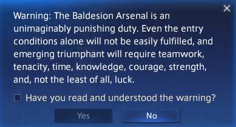
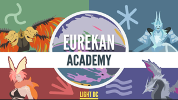
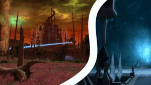
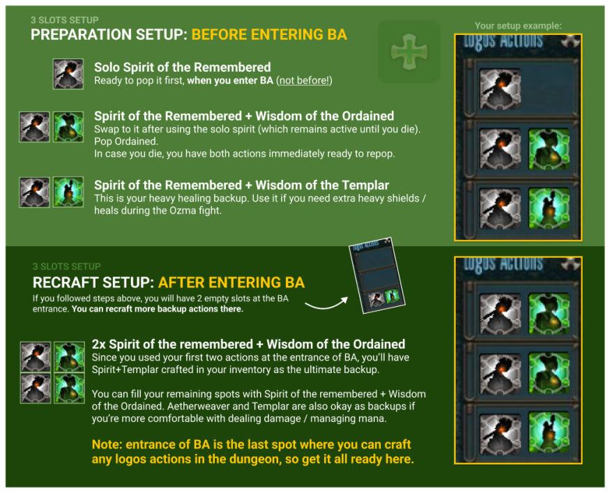
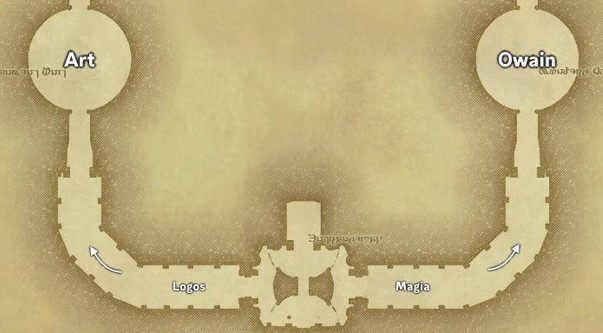
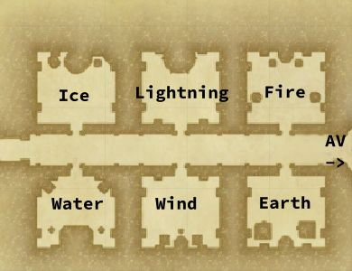
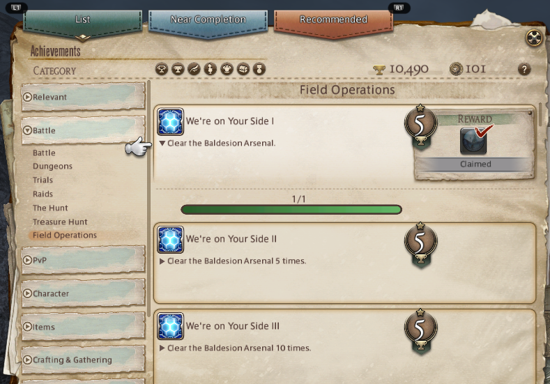
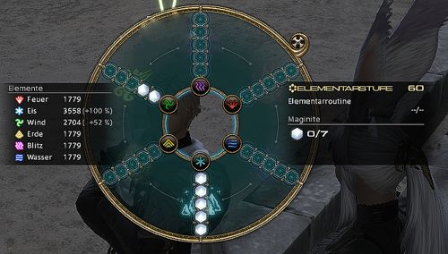
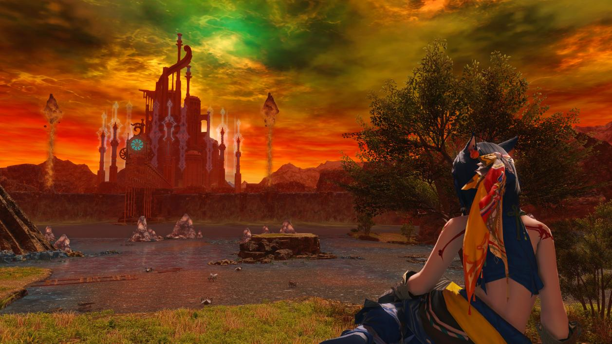

This guide is intended for players who are new to BA, so it will not aim to explain *everything*. Things like chaining `Double Edge`, `Reflect`ing the Earth room or even how to use `Sacrifice` to resurrect someone are beyond the scope of this guide. If you want to learn more, and enjoyed your first run, do check out the resources towards the end, and the two Discord servers have a ton of advanced information to help you continue to learn and become a BA veteran.

* TOC
{:toc}

## What is BA?

The Baldesion Arsenal is the final raid, zoned inside Eureka Hydatos, and has some special rules (e.g. you cannot resurrect people except for using special actions like `Sacrifice` or Healer LB3). You will need Elemental Level 60 to enter and have the main Eureka questline completed.

Eureka has been around since Stormblood and as such is quite old content, but still has very active communities doing the raid frequently. We have a lot of very experienced Raid hosts and Party leads, and aim to make this a welcoming environment for new players and keep the content alive.

Probably the quickest way to check if you have BA unlocked is to use `/title set "Eurekan Explorer"` in your chat, and that should succeed.
Another way to check is if you see no blue lines going towards the building at the horizon, and if the `Expedition Scholar` at (21.1, 13.8) in Hydatos is willing to sell you an `Aetheric Stabilizer` (DON'T buy one, this is just to test).
If this is not the case then you will need to check where you are with your quests and complete them.

### Hydatos questline

- Level 50: Talk to Krile and then, after a cutscene, to Gerolt. After another cutscene, speak again with Krile.
- Level 51: Talk to Krile. Head to The Central Columns at 20.3-24.8 and talk again to Krile. Head south to The Val River Source 25.7-30.7 to find the Pooled Aether. Return to the The Central Columns and speak to Krile.
- Level 54: Talk to Krile. Head to The Western Columns at 10.6-29.6 and talk to Krile again. Head to The West Val River Bank 6.5-15.7 to find the Pooled Aether after walking up the large column. Return to The Western Columns at 10.6-29.6 and talk to Krile.
- Level 57: Talk to Krile at the The Western Columns at 10.6-29.6. Then head east to The Eastern Columns at 31.3-27.2 and talk to Krile again. Head north to The East Val River Bank at 30.8-14.4 to find the Pooled Aether. Return to The Eastern Columns at 31.3-27.2 and talk to Krile.
- Level 60: Talk to Krile at the The Eastern Columns at 31.3-27.2. Head to The Aetherbridge Foundation at 24.0-30.6 and talk again to Krile. Head into the Headquarters Entrance and talk to Krile, then talk to her again in the Board Room. Interact with the Scattered Tomes and talk again to Krile for a few lengthy cutscenes. Choose between Krile's path (sealing) or that of Ejika Tsunjika (destruction) for another cutscene. Return to Central Point and talk to Ejika Tsunjika (when doing Krile's path) or Krile (when doing Ejika's path) to complete the quest.
- Speak with the Expedition Scholar to unlock BA

## How do I join?

For all runs, we are using Discord for voice chat (you don't have to speak, but you need to be able to listen). On the Light datacentre, please join these servers:

Eurekan Academy | Lunar Forays Group
:---:|:---:
 | 
[https://discord.gg/eurekanacademy](https://discord.gg/eurekanacademy) | [https://discord.gg/LunarForays](https://discord.gg/LunarForays)

The Schedule for BA runs can be found [here](https://docs.google.com/spreadsheets/d/1WD_jXdCrQDjzKS0vvqumlmIcSzq4nAnkQBnp7XuUK68/htmlview) and runs are also announced in the various announcement channels too.
On the schedule sheet you can also find invite links for some servers that do BA on Light, as well as Chaos (which you can get to via Datacentre travel). If you are interested, it also lists Delubrum Savage (DRS) runs.

After joining a server, you should also take a look at the `#assign-role` / `#role-selection` channels and get set up so you are able to join the voice channel during a run.

A typical run takes about 2 hours. Not all the time is spent fighting, but if we have new players joining, we spend time on explanations too. And sometimes, Ovni spawn can delay the actual start too - more on that later.

There are several types of BA runs
- Impromptu Runs: These are without sign-up in advance. The code to enter the Party Finder groups will be posted shortly before the run, and all spots are FFA and they're newbie-friendly
- Organised Runs (Newbie/Reclear): These are with signups in advanced and have a fixed roster. Sometimes there are free spots for late joiners, but usually they are filled well in advance
- Challenge runs / Meme runs / Reflex runs / Mechanic runs / Squad runs: Special rules apply on these. Maybe better left for when you are more experienced, as a lot of these are without explanations

## How do I prepare?

### Gear

For equipment, just use your best gear for the job, it will scale down.
Later on, once you got more fragments, you can upgrade your weapon to a `Physeos` version and use `elemental +2` gear to have even better stats.

For your chest slot, you should use:
- Tanks and DPS - [Kirin's Osode of xxx](https://eu.finalfantasyxiv.com/lodestone/playguide/db/item/090fb17ff58/)
- Healers and Casters - [Vermilion Cloak of xxx](https://eu.finalfantasyxiv.com/lodestone/playguide/db/item/0704efd723d/) - note that this item will not allow you to wear a separate Head piece, but that's ok

These two chestpieces are best in slot for doing BA and they benefit from melding too.

To heal through some of the AEs, you can also buy yourself a few [Eurekan Potion](https://eu.finalfantasyxiv.com/lodestone/playguide/db/item/2c070822273/)s from the NPC in Hydatos.

### Logograms

You will need Logograms.
It is important that everone has `Spirit of the Remembered`, and basic dps logograms for their role.

Below are the recommended actions for players who are new to BA. There are more advanced actions you could use (like `Death L`, `Magic Burst` or `Double Edge`), but how to make use of these is better left for another guide, and it is fine if you stick to the basic actions for now.

### Umbral/Astral slots

You will need to know how to craft in both Umbral/Astral slots to make best use of your Logos action slots. Here is how: Put Logograms on either side of the board to make the combinations you want. The example below will make a `Spirit of the Remembered` with a `Wisdom of the Skirmisher`, like it's recommended for DPS players on their first run(s).

Here are some easy recommendations to get you started. If you are unsure, or don't have enough Logograms to craft this set, reach out to us in `#ba-chat` and ask for help.
A great way to view the various recipes for crafts is to use the [Eureka Tracker](https://ffxiv-eureka.com/logograms) website.

### Tanks

### Healers

### Caster DPS

### Melee DPS

### Physical Ranged DPS

## What do we do before we go into BA?

To enter the Arsenal, you need a special buff that is available from either Ovni, or Tristitia. It will allow you to enter the portals. To get the buff, you need to have BA unlocked, and be level 60, and get a gold rating from the fate.
So it is important that you do get a hit in and do some damage to it, otherwise you may not be able to enter BA at all.

Key info for Ovni
- Pull of the Void
    - Concussive Oscillation -  get **OUT** to dodge the AE
    - Megastorm - get **IN** (or far out) to dodge the big Donut AE
- Fluorescence - buffs Ovni, need to use `Dispel L` to remove it
- Ion Shower - run away from the group if you get this, and don't be near the marked player. Does three AEs that are deadly to anyone but the marked player

For most players in the raid, we enter after the Ovni. There often is an additional group on our runs, which we call the Support group. These enter after the support fate is completed - more on that later.
We never use `Aetheric Stabilisers` on our runs, as we have assigned portal locations. Using a stabiliser would cause chaos as the portal locations would likely change and people could loose out on the run. As such **Stabilisers are banned** for the main group and only allowed for the Support group.

Before entering the portals, we take a fairy buff for the extra benefits it provides. It is possible to do BA without it, but it makes it a bit safer, and faster.

So in short:
1. Kill Ovni (The Fate "I don't want to believe")
2. Obtain portal buff from getting a gold rating
3. Go to a fairy
4. Wait for blue portals to appear
5. Grab the fairy buff
6. Head to your assigned portal location, and enter BA once it turns red

The location of your portal can be found on the portal map. During the run, your Party Lead will tell you which group and number you are so you can find it on the map.

The actual portal map is specific to which discord you are running with, as the groups are organised a little differently:

### Portals Eurekan Academy

### Portals Light Forays Group

## Inside BA

Once we entered the Arsenal, we pop a `Spirit of the Remembered` and an appropriate wisdom for your role (for example `Wisdom of the Skirmisher`). Take care to not just activate the Logos action slot, but also to click the action to activate it (so it shows on your buffs list). Then we wait on the bridge until some nice volunteers who brought `Shell` and `Protect` have handed that out to you. After that you can use the Logos Manipulator to recraft Logos actions so you are well prepared for what's ahead.

Now is also the right time to use the `/magiaauto` command. It will adjust your magia wheel to the offensive (or defensive, if you use the command twice) setting. All roles except tanks want to have this on the offensive setting at all times. For tanks it depends if you are one of the main tanks for the run, or at a boss, where you may prefer to be in a defensive element. Let your healers know what you're planning to do!

## Art and Owain

The raid will now split into two groups, where one side does the Art boss, and the other does Owain. These two bosses need to be dealt with at the same time, and which side you go to depends on which group you are in.
Your Party leader will tell you where to go, but if unsure - just ask! Once you dropped down the ledge, you cannot go back to the entrance, so make sure you go to the right side.

### Art

Here is a quick sequence of the things Art will do. Listen for the callouts and dodge his AEs.

1. Thricecull - Tank buster
2. Carver/Spinner. Art does one mechanic, then immediately the other
    - Legendspinner - get **IN** (or very far) to avoid the Donut AE
    - Legendcarver - get **OUT** to avoid the AE
3. Acallum na senorach - Raidwide damage
4. Summon Spears
5. Carver/Spinner. Art does the mechanic, then spears will do the same mechanic right away (dodge quickly!)
6. Acallum na senorach
8. Thricecull
9. Summon Spears
10. Carver/Spinner, spears do the same mechanic after Art
11. *for the full timeline, see the [boss attacks queue sheet](./boss-attacks)*

### Owain

Here is a quick sequence of the things Owain will do. Listen for the callouts and dodge his AEs. Helps if you are aware of where the fire/ice spears are.

1. Thricecull - Tank buster
2. Acallum na senorach - Raidwide damage
3. Summon Spears
4. Elemental Shift - he will be aligned to fire or ice. watch his hands
5. Elemental Magicks - Dodge to the **opposite** type of spear (i.e. if Owain is Ice, go to a Fire spear)
6. Thricecull - Tank buster
7. Acallum na senorach
8. Elemental Shift
9. Elemental Magicks
10. Thricecull
11. *for the full timeline, see the [boss attacks queue sheet](./boss-attacks)*

## A note on Traps

We will usually have one or two people on `Perception` duty (that is a logos action to reveal traps). They will scout ahead to reveal the traps for us, so we can safely avoid them. You never want to go into an area that the trappers have not made safe yet.

Big traps are explosive, and will kill you instantly. The smaller traps apply a nasty DoT that you also want to avoid.

All traps are between Art/Owain and AV, and for the places to search for them you can refer to the following picture:

## Raiden

Raiden is quite straightforward, as long as you listen to the callouts and don't panic. Beware of the Lateral zantetsuken and which direction to dodge it to!

A good way to handle this mechanic is for the whole group to stack in the same place to bait the puddle AEs, pop sprint, and then run together towards Raiden and to the correct side.

1. Spirits of the fallen - raidwide damage
2. Shingan - tankbuster
3. Thundercall - platform edge becomes deadly
4. Ame-no-sakahoko - go south (C marker) to avoid the **BIG AE**
5. Whirling zantetsuken - get **inside his hitbox**
6. Ball lightning - stack to bait AE
7. Lateral zantetsuken - dodge either left or right depending where he holds his sword. Listen to the callouts to make this easy
8. Lancing bolt - If you get marked with this, place your AE around the edge of the arena
9. Booming lament - puddle AEs, dodge them quickly
10. *for the full timeline, see the [boss attacks queue sheet](./boss-attacks)*

## The search for the portal and Elemental rooms

### Finding the portal

Next up, there is more trash to clear and traps to find. just follow along and watch for any AEs. In the "no fun hallways", be sure to not use big AEs like dances, earthly stars, etc as this could pull unwanted mobs!

We will now do two things:
1. Find a treasure chest in one of the rooms
2. Find a green portal that leads us to a different area of BA

Once we found the portal, there is a bit more trash to clear, then the raid splits into the individual groups, and each group clears their assigned room.

### Elemental rooms

Your Party Lead will mark the correct room for you now. Each party will take a separate room to clear, with enemies spawning in a specific element.

If you are the tank in your group, your job is now to clear the trap, using your invulnerability. Also switch your tank stance on, and set your magiaauto to defensive, as you will be tanking something. You can also consider using a `Wisdom of the Guardian` to help with healing if you don't have a lot of +2 gear. When all groups are prepared, tanks step into the blue portal which will spawn the support fate in Hydatos, and two adds per room. We kill these adds quickly, then move on to AV, where we will wait (about 5 min break) for the Support group to arrive.
If you tanked a support room, remember to switch your stance off, and your magiaauto back to offensive (unless you are the main tank of course!).

### Support Fate

Most runs will have a 7th group, that stays behind after Ovni and do the Support Fate. This will spawn **immediately** after the elemental rooms are activated.

Key info for this fate:
- Dualcast - Tornado II (Donut) then **immediately** Aeroaga IV (AE). Or the other way around. Dodge in/out as appropriate
- Spine Lash - frontal cone AoE.
- Shock Spikes - Use `Dispel L` to remove this buff
- Mighty Strikes - Use `Dispel L` to remove this buff
- Meteor - If you forgot to use dispel then this will wipe you, otherwise it's pretty harmless

Additionally, keep `Feint L` up on the boss to lower its evasion stat.

After completing this fate, people will get their portal buffs, just like after Ovni. However, this time the 8 portals will appear in random places. Just spread out, relax, and communicate with each other which portal you want to take. When the blue portals turn red, they will randomise locations once more, so don't rush to the blue ones just yet, wait for red portals on the map.

Once inside, do a quick craft if you have to, otherwise use the Shortcut to join the main group and fight AV + Ozma together.

## Absolute Virtue (AV)

It is recommended to keep `Feint L` up on AV as he's very evasive. Usually the Support Tank brings this action. His mechanics are based on light/dark colours, so we need to avoid the colour he is attuned to.
This is what you are likely to see in the fight:

1. Meteor - Raidwide damage
2. Eidos - AV will pick either light or dark element to attune himself with
3. Hostile Aspect - Dodge Puddles. They will double in size
4. Medusa Jaelin - cone AE. Be close to AV to have an easy time dodging this
5. Eidos
6. Impact Stream - dodge to the opposite colour of AV - if he has dark bracelets, go to the light side
7. Aural Wind - tankbuster
8. Eidos
9. Hostile Aspect - Puddles again, but this time both colours. Watch the pattern and be far from the ones that will expand!
9. Turbulent Aether - if you get a tether, be prepared to take your orb to the opposite coloured puddle
10. Medusa Javelin - dodge the conal AE and **now resolve your orb mechanic**
11. Aural Wind
12. Meteor
13. Meteor
14. Impact stream. Listen to the callouts and don't run too far from the middle
15. Impact stream. Listen to the callouts and don't run too far from the middle
16. Impact stream. Listen to the callouts and don't run too far from the middle
17. Explosive Impulse - Proximity AE - pop `Sprint` and run to the edge
18. Medusa Javelin - be close again to dodge this more easily
19. Aural Wind
20. *for the full timeline, see the [boss attacks queue sheet](./boss-attacks)*

## Ozma

Ah, the final boss!

For this we have 3 main platforms, and a ring. And 6 portal buffers in total (blue circles). Be careful - the floor has been recently polished and is very slippery. A wrong step here and you may fall off and die. And we're so close now, so nobody wants that, right?

Depending on the Discord you run with, the markers and Buffer assignments are different, but you will have an assigned spot for the Black Hole mechanic, so watch which one that is. You will also need to pay attention where your two designated Meteor markers are.

Ozma has several distinct phases/shapes. You don't have to remember this, it will all be called out for you.
- Cube
    - Donut AE, you want to be close
    - Laser attacks, tanks left, group right
    - Orbs, the offtanks handle these
    - Holy knockback
- Pyramid
    - Line AE, get off the platform
    - Bleed attack - see below
    - Acceleration Bomb - see below
    - Meteor Impact - resolve markers and kill adds
- Star
    - Large AE, be far away
    - Continuous shared stack attacks
    - Shooting Star - knockback from the middle of the platform
    - Meteor Impact

We could be in for quite a lengthy explanation here, but I want to keep it simple for you so we will focus on the key facts and key mechanics which are are likely to give you problems as a first-timer.

1. Black Hole. Between Phases, Ozma will turn into a sphere, and eject anyone not on a Black Hole Buffer. Be sure not to greed DPS and stand on yours in time to avoid that
2. Acceleration Bomb. If you got one of these, stop casting, emoting, and, well, **literally don't do a thing** and wait for it to expire before doing anything else. If you notice it in time, you can often move to the ring and avoid getting hit with another mechanic. 
3. Meteors. Repeat after me: **To the back and to the right**.  Place them on the markers that your Party lead will have mentioned to you. If you're unsure - do ask again. This can wipe the raid if you get it wrong. Placing these right also take priority over the Acceleration Bomb, should be be so unlucky and get both mechanics.

*for the full timeline, see the [boss attacks queue sheet](./boss-attacks)*

And finally, for a video run-through of Ozma, there is [FFXIV (Proto) Ozma Class - Ultimate guide for Baldesion Arsenal's final boss](https://www.youtube.com/watch?v=aacZq49cfgw) by Ese for you to enjoy, or  [A Garbage Guide to a Full Run of the Baldesion Arsenal (LIGHT DC)](https://youtu.be/10W9Ut4zTNM) by Lucky for the full raid.

### Acceleration Bomb

<video src='video/accel-bomb.mp4' controls loop muted autoplay></video>

For a good(?), certainly funny explanation on this mechanic, go watch [A Garbage guide to Ozma's Acceleration Bombs](https://www.youtube.com/watch?v=wqiITziXYtY) by Lucky.

### Meteor

<video src='video/meteor.mp4' controls loop muted autoplay></video>

### Bleedbaiting

In Pyramid Phase, one healer per platform will need to stand at the back to bait the bleed AE. They can easily heal themselves and `Esuna` the bleed. It's not very difficult to do, and typically the Expedition Leader will ask for volunteers to handle this part, so feel free to volunteer for it!

If you want to watch a video explaining this in more detail, check out [A Garbage Guide to Bleed Baiting in the Baldesion Arsenal!](https://www.youtube.com/watch?v=uDmmI460GrA) by Lucky.

### Tank Duties

You may be a Main Tank for your platform, which means you will tank Ozma. Or you are an Offtank, which in turn means you are responsible for running into the Orbs in Cube Phase, and tanking the Adds in Star Shape.
A defensive logos action like `Wisdom of the Guardian` is great for both of those duties, and being in defensive element on your magia wheel.
For the Orbs, you will need to take those that spawn to the RIGHT of your platform (i.e. go counter-clockwise).

The Orbs will hit you through invulnerability, so pop plenty of cooldowns when you take those, and be quick with resolving this mechanic to avoid the Orb AEs clipping the main group on the platform.

## Post-BA

Check your Achievements for the mount, you can claim it there. You will find it in Battle / Field Operations:

## This was fun - I want to learn more!!

I hope you enjoyed this quick intro into BA. There is a lot more to it and you can often find special runs that keep the excitement high by using special rules for the run (i.e. only Tanks allowed, or a low number of players to make it more challenging). Even on regular runs, there are many Logos actions which you can use to do more damage, find traps, etc. We are working on some advanced guides for these and video series to explain more of it, so watch this space. This guide will link to the new resources as they become available.
For now, check out the two Discord servers and poke around, they are a real treasure trove of information.

## Magicite and Logos actions upgrades

To get two more magicites, you can farm (or buy) these items:

- Magicite 6: Lamebrix's Dice + Ying-Yang's Tissue + Skoll's Claw
- Magicite 7: Molech's Horn + Goldemar's Horn + Ceto's Claw

Give these to the `Expedition Engineer` in Pyros and Hydatos.

You can put those extra magicites in the defensive element to improve your survivability.

To get more Logos action slots (you can have 6 max), you can speak to the `Expedition Alchemist` in Hydatos and hand over `Aethertight Flask`. That can be obtained by opening a chest from a Hydatos Bunny Fate.

## BA Loot

Art & Owain
* 3 Eureka Fragments
* 1 Damascene Cloth (rare)
* 1 Cryptic Seal (rare)

Raiden
* 6 Eureka Fragments
* 1 Damascene Cloth (rare)
* 1 Cryptic Seal (rare)
* 1 Great Shin-Zantetsuken (rare)
* 1 Shin-Zantetsuken (rare)

Trash Chests (3 per BA run)
* 1 Eureka Fragment
* 5 Obscure Logograms
* 1 Damascene Cloth (rare)
* 1 Cryptic Seal (rare)

Absolute Virtue
* 6 Eureka Fragments
* 1 Damascene Cloth (rare)
* 1 Cryptic Seal (rare)
* 1 Conditional Virtue (minion) (rare)

Proto Ozma
* 10 Eureka Fragments
* 1 Damascene Cloth
* 1 Cryptic Seal
* 1 Turmoil Orchestrion Roll

## Acknowledgements

Guide compiled by ~Fexla Zhed (Lich)~, with the help from the awesome communities in Eurekan Academy and Light Forays Group.

Some graphics have been taken from other guides around the internet and used in good faith.

Thanks for reading all the way to the end, and I hope to see you on a run soon!

`v2024.3.10`
